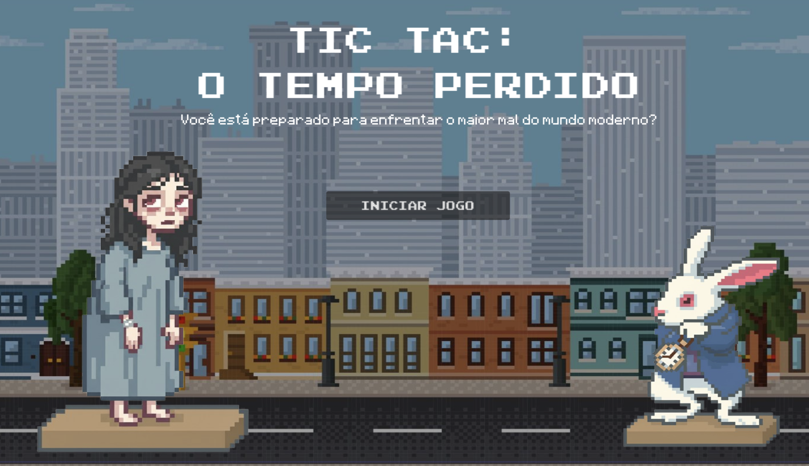

# 🎮 **Tic Tac: O Tempo Perdido**  
### *Trabalho Final de TAPOO – Jogo Digital desenvolvido na Godot Engine 4.x*

---

# **Descrição Geral**

**Tic Tac: O Tempo Perdido** é um jogo narrativo dos gêneros **Hidden Object** e **Puzzle**, que explora a pressa, a distração e o vazio emocional causados pela vida moderna.

O jogador acorda em um espaço mental vazio e, guiado pelo **Coelho de Alice**, deve recuperar fragmentos de memória espalhados por quatro cenários que representam fases da vida marcadas pela correria.

Ao final, a revelação:  
> **A memória não foi perdida por um acidente, mas pelo excesso de distrações que roubaram o presente.**

---

# **Tema e Gênero**

- **Crítica Social:** ritmo acelerado da vida moderna.  
- **Questão Filosófica:** estamos vivendo ou apenas passando pelo tempo?  
- **Tom:** misterioso, melancólico, reflexivo.

---

# **Mecânicas Principais**

### **Objetos Escondidos**
- Cada cenário contém **5 itens-chave** escondidos.
- Interação simples via **clique**.
- Cada item revela um fragmento de memória.

### **Puzzles**
- Cada objeto possui um pequeno enigma.
- 5 enigmas por fase → memória completa da etapa.

### **Cutscenes**
- Sequências textuais curtas.
- Linguagem enigmática e simbólica.

### **Final Reflexivo**
- Uma última cutscene revela a crítica social.
- O jogo termina com a pergunta:
  **"Você está vivendo ou apenas passando pelo tempo?"**

---

# **Cenários e Significados**

| Cenário      | Significado |
|--------------|-------------|
|  Quarto      | A intimidade perdida pela correria. |
|  Escola      | Obrigações, metas e cobranças. |
|  Escritório  | Trabalho incessante e rotina mecânica. |
|  Hospital    | O corpo cobrando o preço da pressa. |

### **Personagens**
- **Coelho de Alice** → Representa o tempo.  
- **Protagonista (Mulher)** → Fragmentada e adoecida emocionalmente.

---

# **Como Executar o Projeto (Godot 4.x)**

### ✔️ **1. Baixar o projeto**
1. Acesse o repositório no GitHub.  
2. Clique em **Code > Download ZIP**.  
3. Extraia o arquivo ZIP em uma pasta de sua preferência.

### ✔️ **2. Instalar a Godot Engine 4.x**
Baixe em:  
https://godotengine.org/download

### ✔️ **3. Abrir o projeto**
1. Abra o Godot 4.x.  
2. Na tela inicial, clique em **Import**.  
3. Navegue até a pasta EXTRAÍDA e selecione o arquivo:  
   **`project.godot`**  
4. Clique em **Import & Edit**.

### ✔️ **4. Executar o jogo**
- Para rodar, pressione **F5** (WINDOWS) ou **Command+B** (MAC).  
- Ou clique no botão **Play** no canto superior direito.

---

# **Como Jogar**

- Clique para interagir com objetos.  
- Encontre os 5 itens escondidos em cada cenário.  
- Resolva os puzzles associados.  
- Recupere todas as memórias e descubra a verdade.

---

#  **Estrutura do Projeto**

- **/assets** — Imagens, artes, ícones  
- **/scenes** — Cenas do Godot (fases + UI)  
- **/scripts** — Scripts GDScript do jogo  
- **/dialogues** — Cutscenes e textos narrativos  
- **project.godot** — Arquivo principal do Godot  

---

# **Grupo – Divas de Info**

- **Júlia Martins** – Programadora Principal  
- **Isadora Ramos** – Designer de Gameplay  
- **Heitor Freitas** – Designer Visual  
- **Maria Fernanda** – Roteirista  
- **Maria Eduarda** – Gerente de Projeto  

---

### COLTEC 2025

